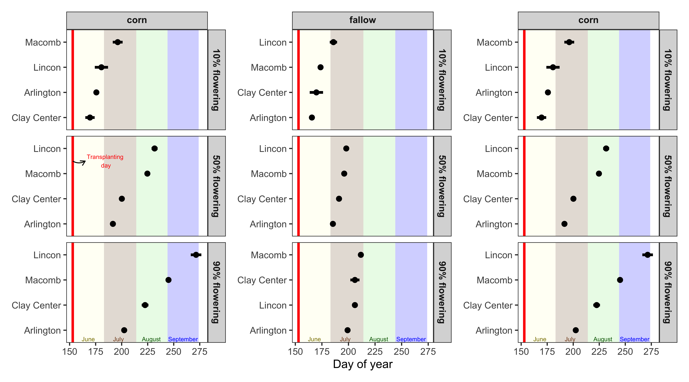

\begin{abstract}

Abstract length and content varies depending on article type. Refer to 
\url{http://www.frontiersin.org/about/AuthorGuidelines} for abstract requirement
and length according to article type.

%All article types: you may provide up to 8 keywords; at least 5 are mandatory.
\tiny
 \keyFont{ \section{Keywords:} Text Text Text Text Text Text Evolution Weed } 

\end{abstract}


# Introduction {-}

kgghkg

# Material and Methods {-}

## Plant material and growing conditions {-}

The study was performed with a *A. palmeri* accession (Per1) from Perkins County, Nebraska. Per1 accession collection is documented in [@oliveira2021a], with no reported herbicide resistance. Three weeks prior to the field experiment, seeds were planted in plastic trays containing potting-mix. Emerged seedlings (1 cm) were transplanted into 200 cm<sup>-3</sup> plastic pots (a plant pot<sup>-1</sup>). Palmer amaranth seedlings were supplied with adequate water and kept under greenhouse conditions at Arlington, Clay Center, Lincoln, and Macomb; and kept outdoors in Grant. Palmer amaranth seedlings were kept under greenhouse/outdoors until the onset of the experiment (7 to 10 cm height). 

## Field study {-}

The experiment was conducted in 2018 and 2019 under field conditions at five locations: Arlington (Washington County, Wisconsin), Clay Center (Clay County, Nebraska), Grant (Perkins County, Nebraska), Lincoln (Lancaster County, Nebraska), and Macomb (McDonough County, Illinois).

The experimental unit were adjacent 9.1 m wide (12 rows at 72.2 cm row spacing) by 10.7 m long. Each experimental unit was planted with corn or soybean, or left fallow. Palmer amaranth seedlings were  transplanted to the field experiment by making a whole in the soil (6 cm deep and 8 cm wide); and gently transferring in the ground (potting mix + two seedlings). After a week, if both plants were alive, one was eliminated. There were two transplant timing: early (June 1^st^) and late (July 1^st^). There were 24 Palmer amaranth plants in each crop/fallow and timing, with a total of 144 plants. The study was repeated twice. 

After transplanting, Palmer amaranth flowering was monitored until the end of the study. When a plant started flowering, the day was recorded, plant sex was identified as male or female, and plant height was measured from soil surface to the plant top. Then, aboveground plant biomass was harvest near soil surface and oven dried at 65 C until reaching constant weight before the weight of biomass (g plant^-1^) was recorded. 


## Statistical analyses {-}

The statistical analyses were performed using R statistical software version 4.0.1. 

The cumulative Palmer amaranth flowering estimation was determined using a asymmetrical three parameter log logistic Weibull model of the drc package [@ritz2015]. 

$$Y(x) = 0 + (d-0) exp (-exp(b(log(x)-e)))$$
In this model, *Y* is the Palmer amaranth cumulative flowering, *d* is the upper limit (set to 100), and *e* is the XXX, and *x* day of year (doy). 

The doy for 10, 50, and 90% Palmer amaranth cumulative flowering were determined using the *ED* function of drc package. Also, the 10, 50, and 90% Palmer amaranth cumulative flowering were compared among crop/fallow and timings using the *EDcomp* function of drc package. The EDcomp function compares the ratio of cumulative flowering using t-statistics, where P-value < 0.05 indicates that we fail to reject the null hypothesis.

# Results {-}

<!-- Comments should be HTML-style comments -->

## Subsection 1 {-}

You can use `R` chunks directly to plot graphs.  

```{r fig1, echo = FALSE, message=FALSE, fig.show = "hide"}

```


## Subsection 2 {-}

Frontiers requires figures to be submitted individually, in the same order as
they are referred to in the manuscript. Figures will then be automatically
embedded at the bottom of the submitted manuscript. Kindly ensure that each
table and figure is mentioned in the text and in numerical order. Permission
must be obtained for use of copyrighted material from other sources (including
the web). Please note that it is compulsory to follow figure instructions.
Figures which are not according to the guidelines will cause substantial delay
during the production process.

# Discussion

# Disclosure/Conflict-of-Interest Statement {-}

<!--  
Frontiers follows the recommendations by the International Committee of Medical
Journal Editors (http://www.icmje.org/ethical_4conflicts.html) which require
that all financial, commercial or other relationships that might be perceived by
the academic community as representing a potential conflict of interest must be
disclosed. If no such relationship exists, authors will be asked to declare that
the research was conducted in the absence of any commercial or financial
relationships that could be construed as a potential conflict of interest. When
disclosing the potential conflict of interest, the authors need to address the
following points:

 - Did you or your institution at any time receive payment or services from a
   third party for any aspect of the submitted work?
 - Please declare financial relationships with entities that could be perceived
   to influence, or that give the appearance of potentially influencing, what
   you wrote in the submitted work.
 - Please declare patents and copyrights, whether pending, issued, licensed
   and/or receiving royalties relevant to the work.
 - Please state other relationships or activities that readers could perceive to
   have influenced, or that give the appearance of potentially influencing, what
   you wrote in the submitted work.
 -->

The authors declare that the research was conducted in the absence of any
commercial or financial relationships that could be construed as a potential
conflict of interest.

# Author Contributions {-}

<!--  

When determining authorship the following criteria should be observed:

 - Substantial contributions to the conception or design of the work; or the
   acquisition, analysis, or interpretation of data for the work; AND
 - Drafting the work or revising it critically for important intellectual
   content; AND
 - Final approval of the version to be published ; AND
 - Agreement to be accountable for all aspects of the work in ensuring that
   questions related to the accuracy or integrity of any part of the work are
   appropriately investigated and resolved.

Contributors who meet fewer than all 4 of the above criteria for authorship
should not be listed as authors, but they should be acknowledged.
(http://www.icmje.org/roles_a.html)

-->

The statement about the authors and contributors can be up to several sentences
long, describing the tasks of individual authors referred to by their initials
and should be included at the end of the manuscript before the References
section.


# Acknowledgments {-}

Funding:

# Supplemental Data 

Supplementary Material should be uploaded separately on submission, if there are
Supplementary Figures, please include the caption in the same file as the
figure. LaTeX Supplementary Material templates can be found in the Frontiers
LaTeX folder

# References

A reference list should be automatically created here. However it won't. Pandoc 
will place the list of references at the end of the document instead. There are 
no convenient solution for now to force Pandoc to do otherwise. The easiest way 
to get around this problem is to edit the LaTeX file created by Pandoc before 
compiling it again using the traditional LaTeX commands.

# Figures {-}


```{r, Figure-2, ref.label = "fig1", echo = FALSE, message = FALSE, fig.height=3, fig.width=5, fig.align='center', fig.cap='Figure caption', out.width = "150mm", out.height = "85mm"}
# You can also refer to code chunks from above to place figures at the bottom.
```


