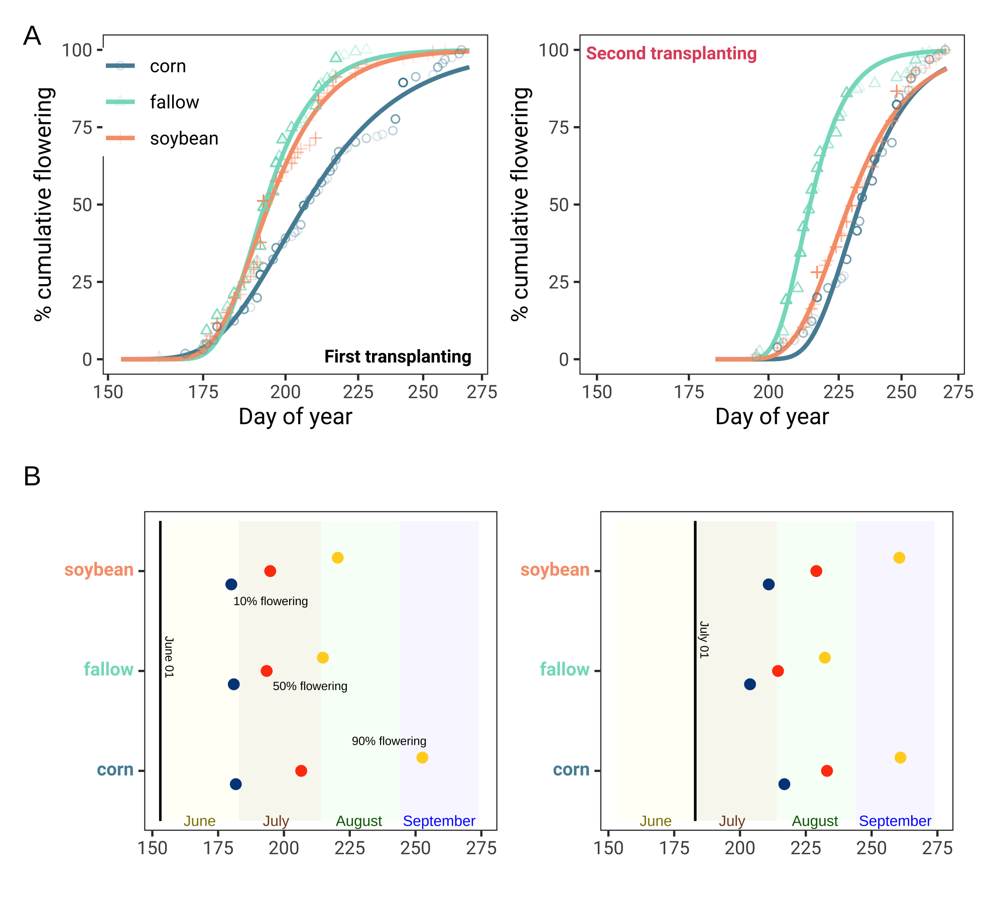
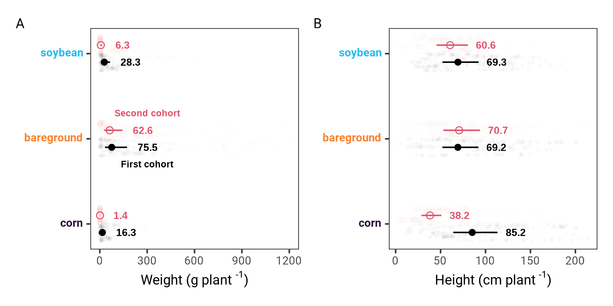

\begin{abstract}

Abstract length and content varies depending on article type. Refer to 
\url{http://www.frontiersin.org/about/AuthorGuidelines} for abstract requirement
and length according to article type.

%All article types: you may provide up to 8 keywords; at least 5 are mandatory.
\tiny
 \keyFont{ \section{Keywords:} Evolution Flowering Management Pigweed Weed} 

\end{abstract}


# Introduction {-}

Palmer amaranth (*Amaranthus palmeri* S. Watson) is currently considered one of the most economically damaged weed species to cropping systems in the United States [@ward2013]. The species has showed a remarkable capacity to evolve resistance to herbicides. Palmer amaranth has evolved resistance to eight herbicide sites of action [@heap2021], increasing the weed management complexity [@lindsay2017]. Uncontrolled Palmer amaranth in competition for water, light and nutrients can drastically reduce crop yields [@berger2015]. Palmer amaranth is documented with potential to reduce 91%, 68%, and 54% of corn [@massinga2001], soybean [@klingaman1994], and cotton [@morgan2001] yields, respectively. Thus, Palmer amaranth poses a risk to sustainable agriculture.

Palmer amaranth is a fast growing summer annual forb indigenous to Sonoran Desert [@sauer1957]. The species would eventually emerge as a threat to US agriculture in the 1990s. Palmer amaranth weediness is likely a result of human-assisted selection in combination with species biology. Farm mechanization, conservation agriculture (e.g., no-till), and reliance on herbicides for weed management are the main human-mediated selection of Palmer amaranth into cropping systems. On the other hand, Palmer amaranth is a prolific seed producer with a C4 photosynthetic apparatus [@ward2013]. With a dioecy nature, Palmer amaranth male and female plants are obligate outcrosser species, increasing the chances of exchanging adaptive traits among plants [@oliveira2018]. Also, Palmer amaranth small seed size (e.g, 1 mm) tend to thrive in no-tillage systems [@price2011], and spread across locations through farm equipment [@sauer1972], manure [@hartzler2016], animals [@farmer2017], and plant propagules [@yu2021]. Therefore, Palmer amaranth dispersal capacity make the species one of the most successful cases of weed adaption to cropping systems.  

Light and temperature are likely the main environment requirements for Palmer amaranth successful adaptation. Palmer amaranth is reported with an extended germination period [@jha2010]. Germination of Palmer amaranth is triggered by 18 C soil temperature [@keeley1987], and optimal germination and biomass production occur at 35/30 C day and night temperatures [@guo2003]. Water has not shown to limit Palmer amaranth fitness. Under continuous water stress, Palmer amaranth survived and produced at least 14000 seeds plant-1 [@chahal2018]. Also, seeds from Palmer amaranth growing under water stress conditions were heavier, less dormant, and prompt for germination [@matzrafi2021]. The continuous global temperature warming can impact agriculture and promote niches for Palmer amaranth invasion/adaptation into new environments. Currently, it is estimated that the greatest climatic risk of Palmer amaranth establishment are agronomic crops in Australia and Sub-Sahara Africa [@kistner2018]. Temperature is a key factor limiting Palmer amaranth expansion to cooler geographies [@briscoerunquist2019]; however, under future climate change Palmer amaranth is likely to expand northward into Canada and Northern Europe [@kistner2018; @briscoerunquist2019].  

Palmer amaranth is already documented in agronomic crops of South America [@larran2017; @kupper2017] and Southern Europe [@milani2021]. In the US, Palmer amaranth is established at crop [@garetson2019] and non-crop land [@bagavathiannan2016] in the warm southern United States but its range is expanding to cool temperatures northward. For example, herbicide resistant Palmer amaranth is widespread in Nebraska  [@oliveira2021a],  Michigan [@kohrt2017], and Connecticut [@aulakh2021]. Successful cases of Palmer amaranth invasion and near to eradication is reported in Minnesota [@yu2021]. No Palmer amaranth actively growing was found in Canada; however, Palmer amaranth seeds was detected in sweet potato slips [@page2021]. Nonetheless, it seems fated the need to manage Palmer amaranth in agronomic crops throughout multiple environments in the near future. Therefore, strategies on Palmer amaranth management should encompass the agroecosystem level but not only attempts to eradicate the weed. Most tactics to manage Palmer amaranth are based on technology fixes [@scott2011], which are short-term (e.g., herbicide and/or tillage) rather than long-term weed management.  

The continuous Palmer amaranth dispersal and potential establishment into northern United States warrant investigations on species morphology growing in such environments.  Understanding Palmer amaranth biology and growing strategies under different agroecossystems can enhance our knowledge on species adaptation. It can also aid on designing proactive and ecological tactics to limit the species range expansion, reduce its negative impact, and design resilient and sustainable farming systems [@maclaren2020].  Therefore, the objective of this study was to investigate the flowering pattern, biomass production, and height of Palmer amaranth growing under in corn, soybean and fallow at two timings across five locations in the mid/upper United States Midwest.  

# Material and Methods {-}  

## Plant material and growing conditions {-}  

The study was performed with a *A. palmeri* accession (Per1) from Perkins County, Nebraska. Per1 accession collection is documented with no reported herbicide resistance [@oliveira2021a]. Three weeks prior to the field experiment, seeds were planted in plastic trays containing potting-mix. Emerged seedlings (1 cm) were transplanted into 200 cm<sup>-3</sup> plastic pots (a plant pot<sup>-1</sup>). Palmer amaranth seedlings were supplied with adequate water and kept under greenhouse conditions at Arlington, Clay Center, Lincoln, and Macomb; and kept outdoors in Grant. Palmer amaranth seedlings were kept under greenhouse/outdoors until the onset of the experiment (2-3 leaf stage/5 to 8 cm height).  

## Field study {-}  

The experiment was conducted in 2018 and 2019 under field conditions at five locations: Arlington (Washington County, Wisconsin), Clay Center (Clay County, Nebraska), Grant (Perkins County, Nebraska), Lincoln (Lancaster County, Nebraska), and Macomb (McDonough County, Illinois).  

A glyphosate-resistant soybean cultivar (DSR-1950 R2Y at 296,400 seeds ha 1), and a corn hybrid were planted at 


Monthly mean air temperature and sum precipitation were collected from June through September across the five locations in 2018 and 2019 (Figure 1)

```{r fig1, echo = FALSE, message=FALSE, fig.show = "hide"}
knitr::include_graphics("../data analysis/weather/Figure 1.png")
```


The field experimental unit were six adjacent 9.1 m wide (12 rows at 72.2 cm row spacing) by 10.7 m long. Each experimental unit was planted with corn or soybean (DSR-1950 R2Y at 296,400 seeds ha 1), or under fallow condition. Palmer amaranth seedlings (potting mix + two seedlings) were and gently transferring to the ground (6 cm deep and 8 cm wide). Twenty-four plants were equidistantly placed (0.76 m apart) between rows within each agroecossystems. After a week, one was eliminated and one was kept. There were two transplant timing: first (June 1) and second (July 1). There were 24 Palmer amaranth plants in each experimental unit, with a total of 144 plants for each location. The study was repeated twice.  

After transplanting, Palmer amaranth flowering was monitored until the end of the study. When a plant started flowering, the day was recorded, plant sex was identified as male or female, and plant height was measured from soil surface to the plant top. Then, aboveground plant biomass was harvest near soil surface and oven dried at 65 C until reaching constant weight before the weight of biomass (g plant 1) was recorded.  

## Statistical analyses {-}  

The statistical analyses were performed using R statistical software version 4.0.1. Data across locations and year were combined.

The cumulative Palmer amaranth flowering estimation was determined using a asymmetrical three parameter log logistic Weibull model of the drc package [@ritz2015].  

$$Y(x) = 0 + (d-0) exp (-exp(b(log(x)-e)))$$
In this model, *Y* is the Palmer amaranth cumulative flowering, *d* is the upper limit (set to 100), and *e* is the XXX, and *x* day of year (doy). 

The doy for 10, 50, and 90% Palmer amaranth cumulative flowering were determined using the *ED* function of drc package. Also, the 10, 50, and 90% Palmer amaranth cumulative flowering were compared among agroecossystems and timings using the *EDcomp* function of drc package. The EDcomp function compares the ratio of cumulative flowering using t-statistics, where P-value < 0.05 indicates that we fail to reject the null hypothesis.  

Palmer amaranth height and biomass were performed with a linear mixed model using *lmer* function from "lme4" package [@bates2015]. Plant height and biomass were transformed to meet model assumption of normality. In the model, agroecosystem (crop, soybean, fallow) was the fixed effect and year nested with location the random effects. Analysis of variance was performed with *anova* function from "car" package [@fox2018]. Marginal means and compact letter display were estimated with *emmeans* and *cld* from packages "emmeans" and multcomp [@hothorn2008].  

# Results {-}  

<!-- Comments should be HTML-style comments -->

## Cumulative flowering {-}  

Palmer amaranth cumulative flowering from first transplant timing ranged from late June to early September (Figure 2). Palmer amaranth growing in corn resulted in a longer flowering pattern compared to fallow and soybean. Palmer amaranth reached 10% flowering in soybean at doy 180, which was slightly different from fallow (doy 180.9; *P* = 0.01) and corn (doy 181.7; *P* = 0.00). Nonetheless, the 10% cumulative Palmer amaranth flowering in soybean, fallow and corn occurred at the end of June. The 50% Palmer amaranth cumulative flowering occurred in July. For example, Palmer amaranth reached 50% in fallow at doy 193.4, followed by soybean (doy 194.8), corn (doy 206.6). Similar trend was observed at 90% Palmer amaranth cumulative flowering. Palmer amaranth growing in corn reached 90% flowering at doy 252.6 (early September), which was 37.8 and 32.2 days after Palmer amaranth 90% flowering in fallow and soybean, respectively.  

```{r fig2, echo = FALSE, message=FALSE, fig.show = "hide"}

```

Palmer amaranth cumulative flowering from second transplanting timing ranged from mid July to mid September (Figure 2). All cumulative flowering comparisons among agroecossystems were significant (*P* < 0.00) Palmer amaranth growing in fallow resulted in earlier flowering time compared to soybean and corn. Palmer amaranth growing in fallow reached 10%, 50%, and 90% flowering time at day 203.8, 214.4, and 232.2, respectively. Palmer amaranth growing in soybean reached 10% flowering at doy 210.9, which was 6 days prior to corn (*P*-value = 0.00). Similar trend was observed at 50% flowering, whereas Palmer amaranth reached 50% flowering in corn (doy 233.0) 4 days after soybeans (doy 228.9; *P* = 0.00). The 90% Palmer amaranth cumulative flowering occurred at same day in corn (260.9) and soybean (260.5; *P* = 0.66).  

```{r eval = FALSE, include = FALSE}
options(scipen = 7)
EDcomp(model4, c(90, 90))

result3 %>% 
  filter(ed == "90" & month == "Second transplanting")
```


## Height and biomass {-}  

Palmer amaranth accumulated more biomass when growing in fallow compared to Palmer amaranth growing in soybean and corn. At first transplanting time, Palmer amaranth biomass was 78.3 g plant-1, 26.4 g plant-1 and 14.9 g plant-1 in fallow, soybean and corn, respectively. Palmer amaranth produce less biomass at second transplanting time. For example, Palmer amaranth growing in fallow resulted in 49.2 g plant-1, 3.4 g plant-1 in soybean and 1.4 g plant when growing in corn.  


```{r eval = FALSE, include = FALSE}
multcomp::cld(analysis$emmeans[[2]], 
              alpha=0.05, Letters=letters, 
              adjust="none", reversed = TRUE)
```


```{r fig3, echo = FALSE, message=FALSE, fig.show = "hide"}

```


```{r fig4, echo = FALSE, message=FALSE, fig.show = "hide"}
knitr::include_graphics("../data analysis/figures/image.jpeg")
```


# Discussion {-}  


# Disclosure/Conflict-of-Interest Statement {-}  

<!--  
Frontiers follows the recommendations by the International Committee of Medical
Journal Editors (http://www.icmje.org/ethical_4conflicts.html) which require
that all financial, commercial or other relationships that might be perceived by
the academic community as representing a potential conflict of interest must be
disclosed. If no such relationship exists, authors will be asked to declare that
the research was conducted in the absence of any commercial or financial
relationships that could be construed as a potential conflict of interest. When
disclosing the potential conflict of interest, the authors need to address the
following points:

 - Did you or your institution at any time receive payment or services from a
   third party for any aspect of the submitted work?
 - Please declare financial relationships with entities that could be perceived
   to influence, or that give the appearance of potentially influencing, what
   you wrote in the submitted work.
 - Please declare patents and copyrights, whether pending, issued, licensed
   and/or receiving royalties relevant to the work.
 - Please state other relationships or activities that readers could perceive to
   have influenced, or that give the appearance of potentially influencing, what
   you wrote in the submitted work.
 -->

The authors declare that the research was conducted in the absence of any
commercial or financial relationships that could be construed as a potential
conflict of interest.

# Author Contributions {-}

RW: designed the experiments; AJ, CP, MB, MO, and SS: conducted the experiments; MO: analyzed the data and wrote the manuscript; AJ, CP, MB, MO, SS, and RW: conceptualized the research. All authors reviewed the manuscript.


# Acknowledgments {-}

Funding: This work received no specific grant from any funding agency, commercial, or not-for-profit sectors

# Supplemental Data 

Supplementary Material should be uploaded separately on submission, if there are
Supplementary Figures, please include the caption in the same file as the
figure. LaTeX Supplementary Material templates can be found in the Frontiers
LaTeX folder

# References

A reference list should be automatically created here. However it won't. Pandoc 
will place the list of references at the end of the document instead. There are 
no convenient solution for now to force Pandoc to do otherwise. The easiest way 
to get around this problem is to edit the LaTeX file created by Pandoc before 
compiling it again using the traditional LaTeX commands.

# Figures {-}

```{r, Figure-1, ref.label = "fig1", echo = FALSE, message = FALSE, fig.height=3, fig.width=6, fig.align='center', fig.cap='Mean average temperature (C) and montly sum precipitation (mm) at Arlington, WI, Clay Center, NE, Grant, NE, Lincoln, NE and Macomb, IL', out.width = "160mm", out.height = "100mm"}
# You can also refer to code chunks from above to place figures at the bottom.
```

```{r, Figure-2, ref.label = "fig2", echo = FALSE, message = FALSE, fig.height=9, fig.width=4, fig.align='center', fig.cap='Cumulative flowering of Palmer amaranth at first and second transplant timing (A) and day of year of 10, 50, and 90 cumulative flowering at first and second transplant timing (B)', out.width = "160mm", out.height = "130mm"}
# You can also refer to code chunks from above to place figures at the bottom.
```

```{r, Figure-3, ref.label = "fig3", echo = FALSE, message = FALSE, fig.height=9, fig.width=4, fig.align='center', fig.cap='Palmer amaranth biomass (A) and height (B) growing in corn, fallow, and soybean across Arlington, Clay Center, Grant, Lincoln, and Macomb', out.width = "130mm", out.height = "70mm"}
# You can also refer to code chunks from above to place figures at the bottom.
```

```{r, Figure-4, ref.label = "fig4", echo = FALSE, message = FALSE, fig.height=9, fig.width=4, fig.align='center', fig.cap='Harvest Palmer amaranth plants at 40 days after first transplant timing. From left to right, Palmer amaranth growing in fallow, soybean and corn in Arlington, Wisconsin', out.width = "70mm", out.height = "70mm"}
# You can also refer to code chunks from above to place figures at the bottom.
```
