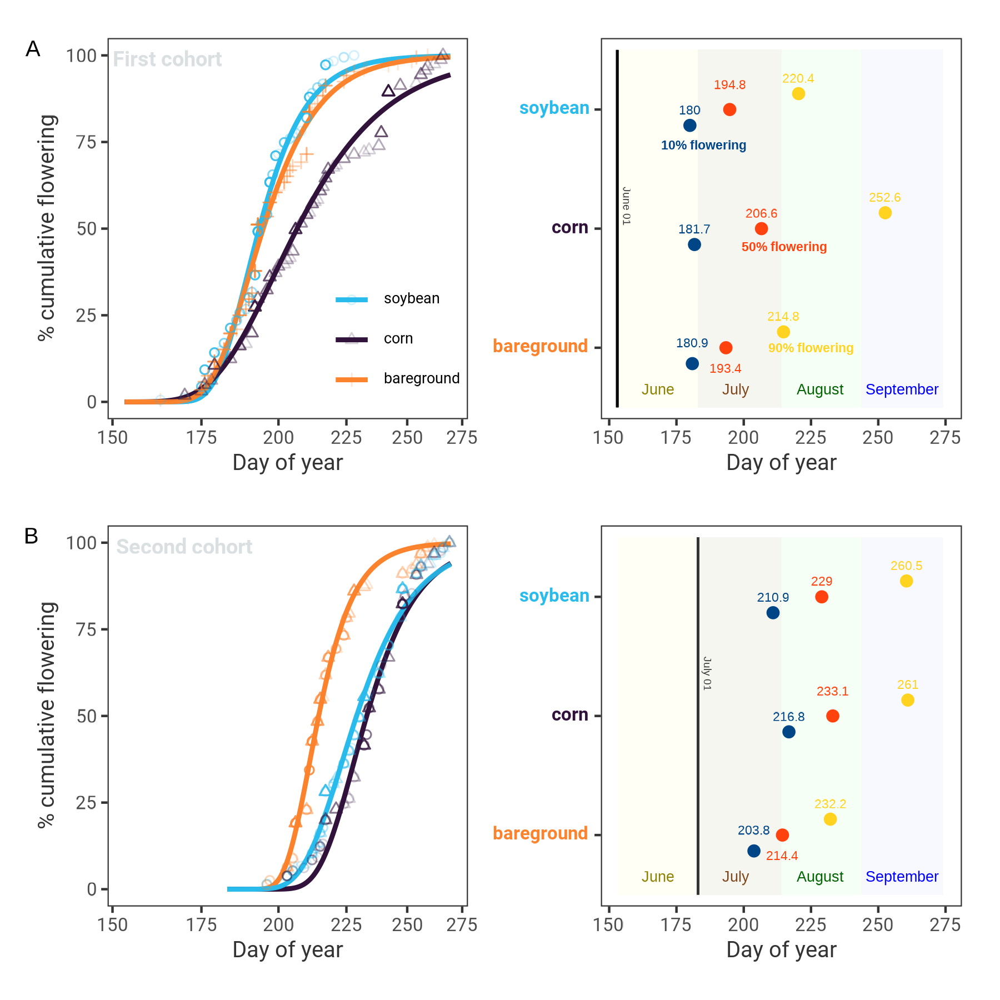

\begin{abstract}

Abstract length and content varies depending on article type. Refer to 
\url{http://www.frontiersin.org/about/AuthorGuidelines} for abstract requirement
and length according to article type.

%All article types: you may provide up to 8 keywords; at least 5 are mandatory.
\tiny
 \keyFont{ \section{Keywords:} Evolution Flowering Management Pigweed Weed} 

\end{abstract}


# Introduction {-}

Palmer amaranth (*Amaranthus palmeri* S. Watson) is currently considered one of the most economically damaged weed species to cropping systems in the United States. Unmanaged Palmer amaranth in competition for water, light and nutrients can drastically impact on crop yields [@berger2015]. For example, Palmer amaranth is documented with potential to reduce 91%, 68%, and 54% of corn [@massinga2001], soybean [@klingaman1994], and cotton [@morgan2001] yields, respectively. Moreover, Palmer amaranth has showed a remarkable capacity to evolve resistance to herbicides. To date, Palmer amaranth has evolved resistance to eight herbicide sites of action [@heap2021], increasing the weed management complexity [@lindsay2017]. Thus, Palmer amaranth poses an economical risk to sustainable agriculture.

Palmer amaranth is a fast growing summer annual forb indigenous to Sonoran Desert [@sauer1957]. The species would eventually emerge as a threat to US agriculture in the 1990s. Palmer amaranth weediness is likely a result of human-assisted selection in combination with species biology. Farm mechanization, conservation agriculture (e.g., no-till), and reliance on herbicides for weed management are the main human-mediated selection of Palmer amaranth into cropping systems [@ward2013]. On the other hand, Palmer amaranth is a prolific seed producer with a C4 photosynthetic apparatus [@wang1992]. With a dioecy nature, Palmer amaranth male and female plants are obligate outcrosser species, increasing the chances of exchanging adaptive traits among plants [@oliveira2018]. Also, Palmer amaranth small seed size (e.g, 1 mm) tend to thrive in no-tillage systems [@price2011], and spread across locations through farm equipment [@sauer1972], manure [@hartzler2016], animals [@farmer2017], and plant propagules [@yu2021]. The dispersal capacity of Palmer amaranth make the species one of the most successful cases of weed adaption to cropping systems.  

Light and temperature are likely the main environment requirements for Palmer amaranth successful grow and development. Palmer amaranth is reported with an extended germination period [@jha2010]. Germination of Palmer amaranth is triggered by 18 C soil temperature [@keeley1987], and optimal germination and biomass production occur at 35/30 C day and night temperatures [@guo2003]. Palmer amaranth germination is also human-mediated by tillage timings and preemergence-applied herbicides [@chahal2021]. Water has not shown to limit Palmer amaranth fitness. Under continuous water stress, Palmer amaranth survived and produced at least 14000 seeds plant-1 [@chahal2018]. Seeds from Palmer amaranth growing with limited water conditions were heavier, less dormant, and prompt for germination [@matzrafi2021]. Growing conditions and management practices also influence Palmer amaranth sex dimorphism and flowering pattern [@korres2017; @rumpa2019]. The continuous global temperature warming can impact agriculture and promote niches for Palmer amaranth invasion/adaptation into new environments. Currently, it is estimated that the greatest climatic risk of Palmer amaranth establishment are agronomic crops in Australia and Sub-Sahara Africa [@kistner2018]. Temperature is a key factor limiting Palmer amaranth expansion to cooler geographies [@briscoerunquist2019]; however, under future climate change Palmer amaranth is likely to expand northward into Canada and Northern Europe [@kistner2018; @briscoerunquist2019].  

Palmer amaranth is already found in agronomic crops of South America [@larran2017; @kupper2017] and Southern Europe [@milani2021]. In the US, Palmer amaranth is well established at cotton fields [@garetson2019] and non-crop areas [@bagavathiannan2016] in the southern United States but its range is expanding northward. For example, herbicide resistant Palmer amaranth is widespread in Nebraska  [@oliveira2021a],  Michigan [@kohrt2017], Connecticut [@aulakh2021], and potential damaged to soybean fields in Illinois is reported [@davis2015]. In Iowa, a study showed that Palmer amaranth is still not well adapted compared to waterhemp (*Amaranthus tuberculatus*) [@baker2021]. Successful cases of Palmer amaranth invasion and near to eradication is documented in Minnesota [@yu2021]. No Palmer amaranth actively growing was found in Canada; however, Palmer amaranth seeds was detected in sweet potato slips [@page2021]. Nonetheless, it seems fated the need to manage Palmer amaranth in agronomic crops throughout multiple environments in the near future. Strategies on Palmer amaranth management should encompass the agroecosystem level but not only attempts to eradicate the weed. Most tactics to manage Palmer amaranth are based on technology fixes [@scott2011], which are short-term (e.g., herbicide and/or tillage) rather than long-term weed management. Palmer amaranth management should be built on minimizing the species ability to adapt, grow and develop into agroecossystems. 

In the southeastern US, early growing Palmer amaranth is well known to have higher impact on cotton yields than late established plants [@macrae2013]. In the northern states, Palmer amaranth impact on the agroecossystem is recent. Studies investigating Palmer amaranth in those locations is limited due to the plant classification as noxious weed species [@yu2021]. Nonetheless, the continuous Palmer amaranth dispersal and potential establishment across northern United States is concerning and warrant investigations on species morphology in such environments. Understanding Palmer amaranth biology and growing strategies under different agroecossystems can enhance our knowledge on species adaptation. It can also aid on designing proactive and ecological tactics to limit the species range expansion, reduce its negative impact, and design resilient and sustainable farming systems [@maclaren2020]. Therefore, the objective of this study was to investigate the flowering pattern, gender, biomass production, and height of Palmer amaranth growing under corn, soybean and fallow at two timings across five locations in the United States Midwest.  

# Material and Methods {-}  

## Plant material and growing conditions {-}  

The study was performed with a Palmer amaranth accession (Per1) from Perkins County, Nebraska. Per1 accession collection is documented with no reported herbicide resistance [@oliveira2021a]. Three weeks prior to the field experiment, seeds were planted in plastic trays containing potting-mix. Emerged seedlings (1 cm) were transplanted into 200 cm<sup>-3</sup> plastic pots (a plant pot<sup>-1</sup>). Palmer amaranth seedlings were supplied with adequate water and kept under greenhouse conditions at Arlington, Clay Center, Lincoln, and Macomb; and kept outdoors in Grant. Palmer amaranth seedlings were kept under greenhouse/outdoors until the onset of the experiment (2-3 leaf stage/5 to 8 cm height).  

## Field study {-}  

The experiment was conducted in 2018 and 2019 under field conditions at five locations: Arlington (Washington County, Wisconsin), Clay Center (Clay County, Nebraska), Grant (Perkins County, Nebraska), Lincoln (Lancaster County, Nebraska), and Macomb (McDonough County, Illinois).  

A glyphosate-resistant soybean cultivar (DSR-1950 R2Y at 296,400 seeds ha 1), and a corn hybrid were planted at 


Monthly mean air temperature and sum precipitation were obtained using Daymet weather data from June through September across the five locations in 2018 and 2019 [@correndo2021] (Figure 1)

```{r fig1, echo = FALSE, message=FALSE, fig.show = "hide"}
knitr::include_graphics("../data analysis/weather/Figure 1.png")
```


The field experimental unit were six adjacent 9.1 m wide (12 rows at 72.2 cm row spacing) by 10.7 m long. Each experimental unit was planted with corn or soybean (DSR-1950 R2Y at 296,400 seeds ha 1), or under fallow condition. Palmer amaranth seedlings (potting mix + two seedlings) were and gently transferring to the ground (6 cm deep and 8 cm wide). Twenty-four plants were equidistantly placed (0.76 m apart) between rows within each agroecossystems. After a week, one was eliminated and one was kept. There were two transplant timing: first (June 1) and second (July 1). There were 24 Palmer amaranth plants in each experimental unit, with a total of 144 plants for each location. The study was repeated twice.  

After transplanting, Palmer amaranth flowering was monitored until the end of the study. When a plant started flowering, the day was recorded, plant sex was identified as male or female, and plant height was measured from soil surface to the plant top. Then, aboveground plant biomass was harvest near soil surface and oven dried at 65 C until reaching constant weight before the weight of biomass (g plant 1) was recorded.  

## Statistical analyses {-}  

The statistical analyses were performed using R statistical software version 4.0.1. Data across locations and year were combined.

The cumulative Palmer amaranth flowering estimation was determined using a asymmetrical three parameter log logistic Weibull model of the drc package [@ritz2015].  

$$Y(x) = 0 + (d-0) exp (-exp(b(log(x)-e)))$$
In this model, *Y* is the Palmer amaranth cumulative flowering, *d* is the upper limit (set to 100), and *e* is the XXX, and *x* day of year (doy). 

The doy for 10, 50, and 90% Palmer amaranth cumulative flowering were determined using the *ED* function of drc package. Also, the 10, 50, and 90% Palmer amaranth cumulative flowering were compared among agroecossystems and timings using the *EDcomp* function of drc package. The EDcomp function compares the ratio of cumulative flowering using t-statistics, where P-value < 0.05 indicates that we fail to reject the null hypothesis.  

Palmer amaranth gender was fitted to a binary logistic regression [@bangdiwala2018]. Binary logistic regression is used for predicting binary classes, such gender of Palmer amaranth plants. Prior to the analysis, all missing values were removed from the dataset. Also, data from Grant was not used in this analysis due to the uniform plant harvesting at that location. The whole dataset was splitted into 80% train and 20% test data. The 80% train is used for the model training and the rest 20% is used for checking how the model generalized on unseen dataset. With 80% dataset, a binary response variable, male (0) and female (1), was fitted to a generalized linear model (*glm* function) including day of year harvest, height, weight, crop and month as independent variables. The model family was binomial with a logit function. The model fit was assessed through pseudo R squared values (McFadden, Cox and Snell, Cragg and Uhler) and likelihood ratio using *nagelkerke* function ("rcompanion" package). The marginal effects computation was performed with Average Marginal Effects at every observed value of x and average across the results (AMEs) [@leeper2017] using *margins* function from "margins" package. The rest 20% dataset was predicted using *predict* function with a cutoff estimation for male or female using *performance* function. The model quality prediction from the classification algorithm was measure with precision (*precision* function), recall (*recall* function) and F1 score (*f_meas* function) using "yardstick" package. The precision determines the accuracy of positive predictions (female plants), recall determines the fraction of positives that were correctly identified, and F1 score is a weighted harmonic mean of precision and recall with the best score of 1 and the worst score of 0. F1 score conveys the balance between the precision and the recall.

Palmer amaranth height and biomass were performed with a linear mixed model using *lmer* function from "lme4" package [@bates2015]. Plant height and biomass were transformed to meet model assumption of normality. In the model, agroecosystem (crop, soybean, fallow) was the fixed effect and year nested with location the random effects. Analysis of variance was performed with *anova* function from "car" package [@fox2018]. Marginal means and compact letter display were estimated with *emmeans* and *cld* from packages "emmeans" and "multcomp" [@hothorn2008].  


# Results {-}  

<!-- Comments should be HTML-style comments -->


## Palmer amaranth height and biomass {-}  

Palmer amaranth accumulated more biomass when growing in fallow compared to Palmer amaranth growing in soybean and corn (Figure 3A). At first cohort time, Palmer amaranth biomass was 75.5 g plant-1, 28.3 g plant-1 and 16.3 g plant-1 in fallow, soybean and corn, respectively. At second cohort timing, Palmer amaranth produced 62.6 g plant in fallow, followed by 6.3 g plant in soybean, and 1.4 g plant in corn. 

Palmer amaranth height was more uniform across cohort timings, except when growing in corn (Figure 3B). Palmer amaranth achieved 69.2 cm tall when growing at first cohort timing in bareground, which was not different to 70.7 cm tall at second cohort timing (P = 0.74). In addition, no difference in Palmer amaranth height (69.3 cm) was found in soybean at first cohort compared to fallow (P > 0.75). At second cohort in soybean, Palmer amaranth was near to 10 cm lower compared to its first cohort time (P = 0.04). The tallest and smallest Palmer amaranth plants were found in corn. Palmer amaranth reached 85.2 cm tall at first cohort and 38.2 cm at second cohort timings.


## Palmer amaranth cumulative flowering {-}  


Palmer amaranth growing in corn resulted in a longer flowering pattern compared to fallow and soybean at first cohort (Figure 2A). Nonetheless, the 10% cumulative Palmer amaranth flowering in soybean, fallow and corn occurred at the end of June. Palmer amaranth reached 10% flowering in soybean at doy 180, which was slightly different from fallow (doy 180.9; *P* = 0.01) and corn (doy 181.7; *P* = 0.00). The 50% Palmer amaranth cumulative flowering occurred in July. For example, Palmer amaranth reached 50% flowering in fallow at doy 193.4, followed by soybean (doy 194.8), corn (doy 206.6). Similar trend was observed at 90% Palmer amaranth cumulative flowering. Palmer amaranth growing in corn reached 90% flowering at doy 252.6 (early September), which was 37.8 and 32.2 days after Palmer amaranth 90% flowering in fallow and soybean, respectively.  

```{r fig2, echo = FALSE, message=FALSE, fig.show = "hide"}
knitr::include_graphics("../data analysis/figures/Figure 2.png")
```

Palmer amaranth cumulative flowering at second cohort ranged from mid July to mid September (Figure 2B). Palmer amaranth growing in fallow resulted in earlier flowering time compared to soybean and corn. Palmer amaranth growing in fallow reached 10%, 50%, and 90% flowering time at day 203.8, 214.4, and 232.2, respectively. Palmer amaranth growing in soybean reached 10% flowering at doy 210.9, which was 6 days prior to corn (*P*-value = 0.00). Similar trend was observed at 50% flowering, whereas Palmer amaranth reached 50% flowering in corn (doy 233.0) 4 days after soybeans (doy 228.9; *P* = 0.00). The 90% Palmer amaranth cumulative flowering occurred at same day in corn (260.9) and soybean (260.5; *P* = 0.66).  

```{r eval = FALSE, include = FALSE}
options(scipen = 7)
EDcomp(model4, c(90, 90))

result3 %>% 
  filter(ed == "90" & month == "Second transplanting")
```

## Palmer amaranth gender {-} 

The model fit was 0.11, 0.14, 0.18 with using pseudo R squared test from McFadden, Cox and Snell, and Cragg and Uhler, respectively. The likelihood ratio test showed a p-value of < 0.00. The average marginal effects showed that increasing a weight unit by 1 g increases the probability of having a female plant by 0.08% (P = 0.01). Similar trend is observed to height as well as doy, whereas the probability of being female increase by 0.2% (P = 0.01) and 0.4% (P = 0.00) when a unit of height (cm) and day increases, respectively.

The model accuracy evaluation accuracy in the unseen 20% dataset was 0.61 with a cutoff value for female and male plants of 0.49. The model classification showed a precision of 0.59, recall of 0.76, and a F1 score of 0.66. In addition, the area under the curve was 0.61.


```{r eval = FALSE, include = FALSE}
multcomp::cld(analysis$emmeans[[2]], 
              alpha=0.05, Letters=letters, 
              adjust="none", reversed = TRUE)
```


```{r fig3, echo = FALSE, message=FALSE, fig.show = "hide"}
knitr::include_graphics("../data analysis/figures/Figure 3.png")
```


```{r fig4, echo = FALSE, message=FALSE, fig.show = "hide"}
knitr::include_graphics("../data analysis/figures/image.jpeg")
```


```{r fig5, echo = FALSE, message=FALSE, fig.show = "hide"}

```


# Discussion {-}  

Our study showed that Palmer amaranth biomass, height, flowering pattern and gender varied within agroecossystems and cohort timings. In general, Palmer amaranth produced more biomass and taller plants when growing at first cohort rather than second cohort. At first cohort, resources (e.g., soil nutrients) and conditions (e.g., light) were more timely available for both species, crop and weed. High biomass and taller Palmer amaranth plants are likely a weed strategy to compete for light in between crop rows in absence of canopy. In such condition, Palmer amaranth showed an extraordinary plasticity to adapt upon the agroecosystem. This is evident when comparing Palmer amaranth canopy shape, and its extended flowering pattern when growing into corn compared to soybean. The Palmer amaranth competition strategy was to mimic the crop grow and development (Figure 4). These results suggests that Palmer amaranth can fast evolve life-history traits to adapt  into agroecossystems and cultural practices, including nitrogen fertilization [@bravo2018]. Our results highlight the Palmer amaranth as a threat to agroecossystems as breeding more competitive crop varieties is likely to select more competitive biotypes [@bravo2017].

Palmer amaranth grow and development at second cohort was limited due to the crop competitive ability at advanced development stages. Palmer amaranth was transplanted when corn canopy was nearly closed, which reduced Palmer amaranth competitiveness. As a result, Palmer amaranth height and biomass was lower compared to its first cohort. Under crop canopy (e.g., second cohort), Palmer amaranth flowering pattern was near to similar in corn and soybean. Palmer amaranth growing without crop competition produced highest amounts of biomass and less extended flowering pattern. The Palmer amaranth strategy in bareground was to invest biomass in growing plant width and height. Nonetheless, Palmer amaranth produced 21% less biomass in second cohort compared to first cohort timing. In a bareground study, early emerged Palmer amaranth without competition was 50% taller than late emerged plants [@webster2015]. These results suggests that crop competition is not the only factor limiting late Palmer amaranth establishment. The limited growth of Palmer amaranth at second cohort is likely a reduced plant response to thermal units (e.g, growing degree days). It is hypothesize that reduced day length contributed to smaller plants at second cohort as well as shorter flowering period. A study in North Carolina and Illinois predicted that less than 10% Palmer amaranth seedlings emergence occurred after June [@piskackova2021]. In addition, Palmer amaranth negative impact on soybean [@korres2020] and cotton [@webster2015] yields was higher when plants were established near to crop planting.

Seed production was not evaluated due to plant harvest at initiation of flowering. Nonetheless, it is well documented a strong positive correlation between Palmer amaranth biomass and seed production [@schwartz2016; @spaunhorst2018]. I our study, Palmer amaranth growing at first cohort accumulated an overall 36% more biomass when compared to second cohort. Therefore, Palmer amaranth plants growing in the second cohort is likely to produce less seeds regardless the agroecossystem. Our observation is consistent with the findings that first Palmer amaranth cohort produced 50% more seeds per plant than Palmer amaranth plants established six weeks later in bareground [@webster2015]. Still, seed production at second cohort is likely to replenish the soil seedbank. Seed production and deposition in the seedbank is also a key factor for species perpetuation [@menges1987]. Palmer amaranth can produce hundred thousands seeds per plant [@schwartz2016; @keeley1987], and stay viable buried in the seedbank for at least 36 months [@sosnoskie2013]. Therefore, preventing Palmer amaranth seed production or/and seed migration to its non-native habitat is an essential strategy to minimize weed impact into agroecossystem [@davis2015].

An ecological approach to reduce seed production in Palmer amaranth is understanding its flowering pattern. Our study suggests that Palmer amaranth flowering pattern was slightly influenced by cropping systems and cohort timings. Palmer amaranth growing in fallow and corn resulted in the overall shortest and longest flowering pattern, respectively. When growing in soybean, Palmer amaranth flowering pattern was similar to bareground at first cohort but similar to corn at second cohort timing. Plant flowering initiation is complex and it depends on biological and ecological factors [@lang1965]. We hypothesize that when growing in high competition (e.g., second cohort), Palmer amaranth plants tend to initiate flowering early, as well as having an extended flowering pattern. Early flower initiation is plant strategy when growing in stress conditions. For example, when growing under water stress, early flowering in Palmer amaranth resulted in a mismatch between female and male plants by seven days [@mesgaran2021]. A mismatch in Palmer amaranth male and female flowering period can minimize plant outcross, and thus reduce plant seed production. Sex dimorphism manipulation is considered a potential ecological pest control [@mcfarlane2018; @schliekelman2005].

The mechanisms of sex-determination in plant species is intriguing and arouse the curiosity of many scientists, including Darwin [@darwin1888]. In our study, the gender model performance was decent considering the biology of plant flowering. A 1:1 male and female sex ratio is a general evolutionary stable strategy for plant species perpetuation [@fisher1930]. However, a slight deviation from 1:1 sex ratio might occur in some dioecious species. For example, the dioecious *Halophila stipulacea* is a female-biased plant in its native habitat, but the naturalized *H. stipulacea* have a 1:1 ratio [@nguyen2018]. Naturalized of *H. stipulacea* reduced female-male ratio to expand into its non-native habitat [@nguyen2018]. Also, biotic and/or abiotic stress can influence plant sex determination. Palmer amaranth  male-to-female ratio was greater under high plant densities [@korres2017a] and after herbicide application [@rumpa2019]. Our model estimated that late flowering, heavier and taller Palmer amaranth plants deviated from 1:1 ratio in favor to female plants. It was reported that female Palmer amaranth plants invested more in height, stem and biomass while male invested more in leaf area and leaf dry weight under nutrient deficiency [@korres2017]. Our model also estimated more female plants in soybean and bareground compared to corn, which might linked to plant competition strategy in each agroecossystem. Our results showed the influence of life-history and ecological traits on sexual dimorphism in Palmer amaranth. Sexual dimorphism is documented in other dioecious species [@barrett2013]. For example, stronger female plant competition and greater male tolerance to herbivory was reported in *Spinacia oleracea* [@perez-llorca2019]. Research on candidate genes for sex determination in *Amaranthus* species are currently underway but it is far to complete [@montgomery2021; @montgomery2019]. Further studies are also needed to understand the ecological basis of Palmer amaranth flowering, including the plant behavior under climate change.

Our study demonstrated the short-term Palmer amaranth plasticity to grow and develop into cropping-systems. Palmer amaranth management priority should focus on minimizing Palmer amaranth dispersal into new geographies. Flower manipulation is a promising ecological Palmer amaranth but it is not well understood. Nonetheless, early-season management programs would have a large negative effect in Palmer amaranth growth and development. Tactics that promote early-season crop advantage against Palmer amaranth, including early crop planting, crop rotation [@oliveira2021a], plant width, preemergence applied herbicide [@sanctis2021], and crop residue (e.g. cover crops) would minimize the negative impact of Palmer amaranth in agroecossystems. 


# Disclosure/Conflict-of-Interest Statement {-}  

<!--  
Frontiers follows the recommendations by the International Committee of Medical
Journal Editors (http://www.icmje.org/ethical_4conflicts.html) which require
that all financial, commercial or other relationships that might be perceived by
the academic community as representing a potential conflict of interest must be
disclosed. If no such relationship exists, authors will be asked to declare that
the research was conducted in the absence of any commercial or financial
relationships that could be construed as a potential conflict of interest. When
disclosing the potential conflict of interest, the authors need to address the
following points:

 - Did you or your institution at any time receive payment or services from a
   third party for any aspect of the submitted work?
 - Please declare financial relationships with entities that could be perceived
   to influence, or that give the appearance of potentially influencing, what
   you wrote in the submitted work.
 - Please declare patents and copyrights, whether pending, issued, licensed
   and/or receiving royalties relevant to the work.
 - Please state other relationships or activities that readers could perceive to
   have influenced, or that give the appearance of potentially influencing, what
   you wrote in the submitted work.
 -->

The authors declare that the research was conducted in the absence of any
commercial or financial relationships that could be construed as a potential
conflict of interest.

# Author Contributions {-}

RW: designed the experiments; AJ, CP, MB, MO, and SS: conducted the experiments; MO: analyzed the data and wrote the manuscript; AJ, CP, MB, MO, SS, and RW: conceptualized the research. All authors reviewed the manuscript.


# Acknowledgments {-}

Funding: This work received no specific grant from any funding agency, commercial, or not-for-profit sectors

# Supplemental Data 

Supplementary Material should be uploaded separately on submission, if there are
Supplementary Figures, please include the caption in the same file as the
figure. LaTeX Supplementary Material templates can be found in the Frontiers
LaTeX folder

# References

A reference list should be automatically created here. However it won't. Pandoc 
will place the list of references at the end of the document instead. There are 
no convenient solution for now to force Pandoc to do otherwise. The easiest way 
to get around this problem is to edit the LaTeX file created by Pandoc before 
compiling it again using the traditional LaTeX commands.

# Figures {-}

```{r, Figure-1, ref.label = "fig1", echo = FALSE, message = FALSE, fig.height=3, fig.width=6, fig.align='center', fig.cap='Mean average temperature (C) and montly sum precipitation (mm) at Arlington, WI, Clay Center, NE, Grant, NE, Lincoln, NE and Macomb, IL', out.width = "160mm", out.height = "100mm"}
# You can also refer to code chunks from above to place figures at the bottom.
```

```{r, Figure-2, ref.label = "fig2", echo = FALSE, message = FALSE, fig.height=9, fig.width=4, fig.align='center', fig.cap='Cumulative flowering of Palmer amaranth at first and second transplant timing (A) and day of year of 10, 50, and 90 cumulative flowering at first and second transplant timing (B)', out.width = "130mm", out.height = "130mm"}
# You can also refer to code chunks from above to place figures at the bottom.
```

```{r, Figure-3, ref.label = "fig3", echo = FALSE, message = FALSE, fig.height=9, fig.width=4, fig.align='center', fig.cap='Palmer amaranth biomass (A) and height (B) growing in corn, fallow, and soybean across Arlington, Clay Center, Grant, Lincoln, and Macomb', out.width = "130mm", out.height = "70mm"}
# You can also refer to code chunks from above to place figures at the bottom.
```

```{r, Figure-4, ref.label = "fig4", echo = FALSE, message = FALSE, fig.height=9, fig.width=4, fig.align='center', fig.cap='Harvest Palmer amaranth plants at 40 days after first transplant timing. From left to right, Palmer amaranth growing in fallow, soybean and corn in Arlington, Wisconsin', out.width = "70mm", out.height = "70mm"}
# You can also refer to code chunks from above to place figures at the bottom.
```

```{r, Figure-5, ref.label = "fig5", echo = FALSE, message = FALSE, fig.height=9, fig.width=4, fig.align='center', fig.cap='Cumulative flowering of Palmer amaranth at first and second transplant timing (A) and day of year of 10, 50, and 90 cumulative flowering at first and second transplant timing (B)', out.width = "170mm", out.height = "70mm"}
# You can also refer to code chunks from above to place figures at the bottom.
```
